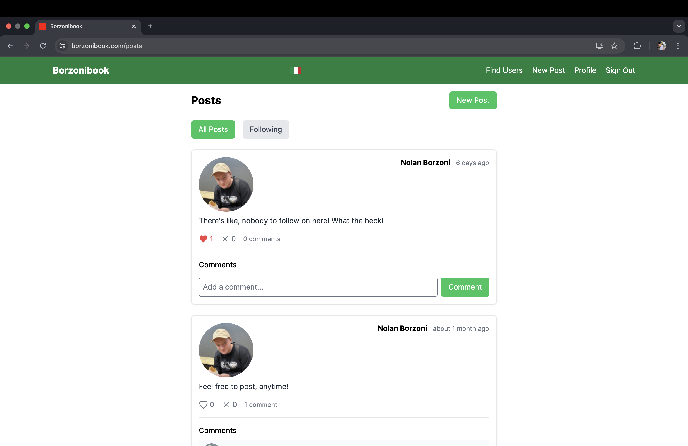
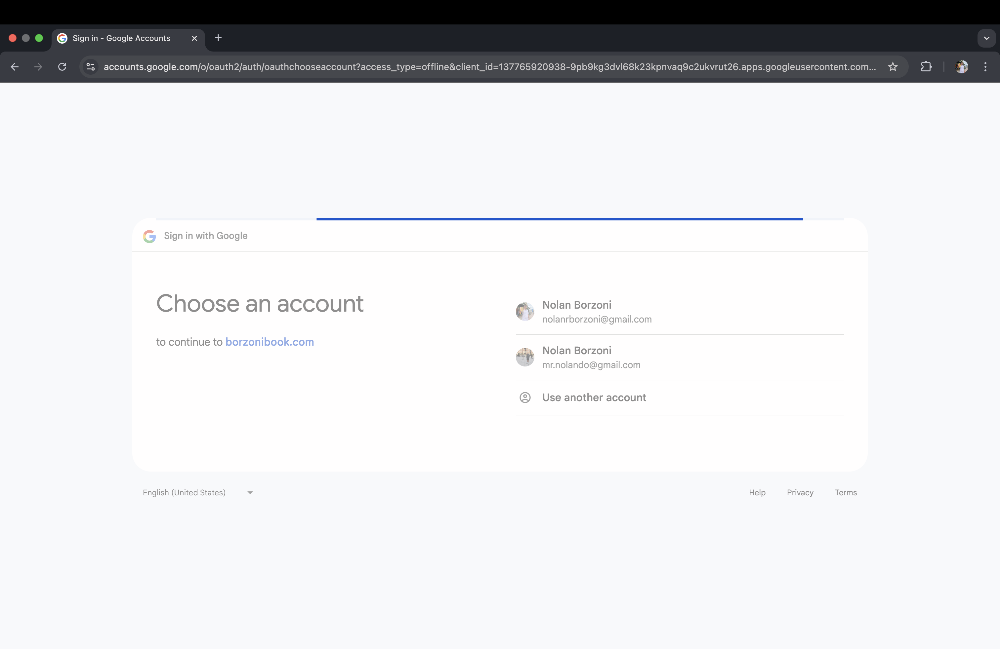
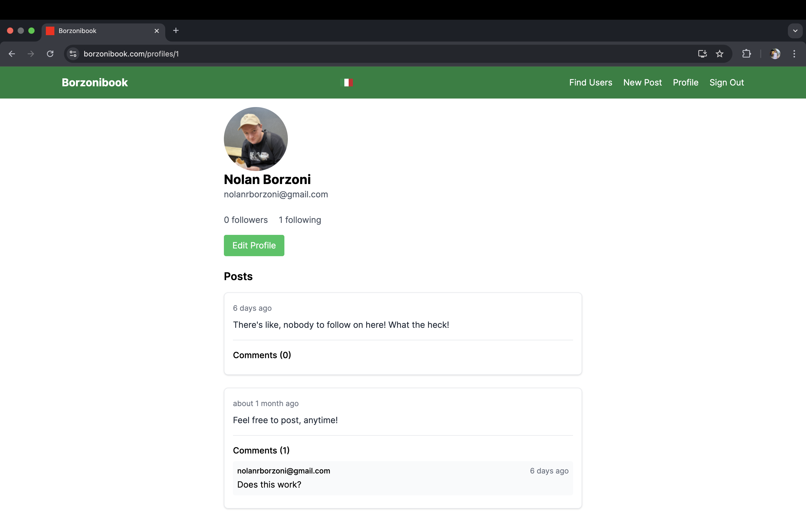
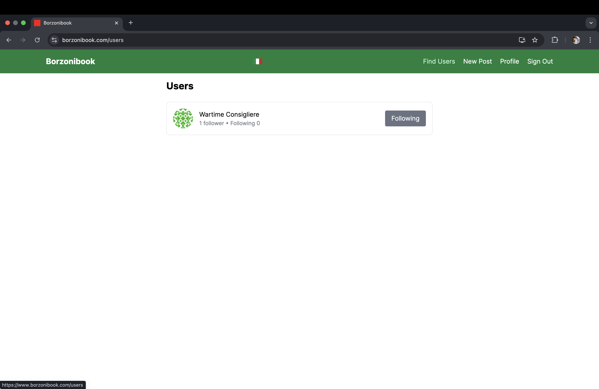

Borzonibook is an SNS Ruby on Rails application built for fun with the intention of it being a place the Borzoni's of the world could connect.

**Features**
- Create and mangage your account using Devise, or just login through your Google account (Oauth2)
- Write posts to share with other users
- Like, dislike, and comment on posts
- Follow other users and filter your feed to see only posts from those you follow

**Demo Screenshots**
View posts from other users on the site, or from just users you follow.

Create your account and login using Oauth2.

Customize your profile, username, and bio.

Follow and unfollow other users on the site.

